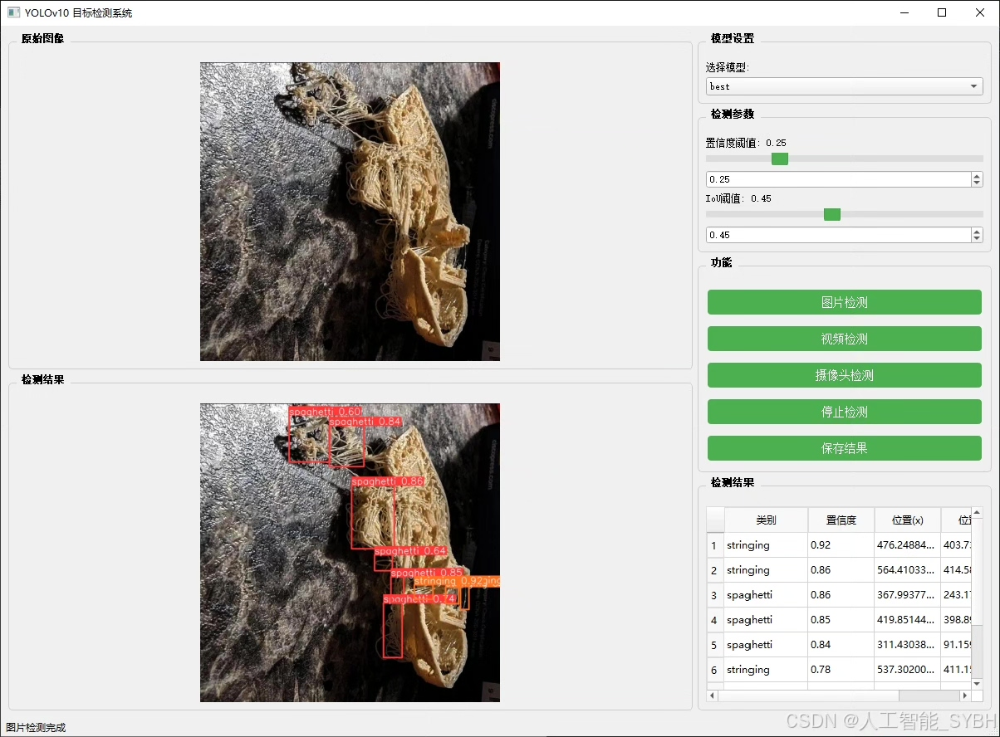
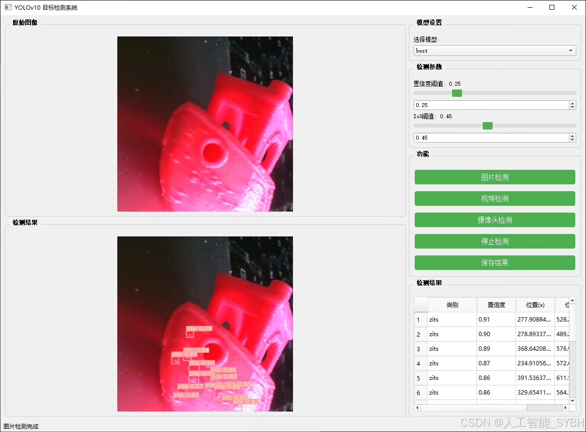
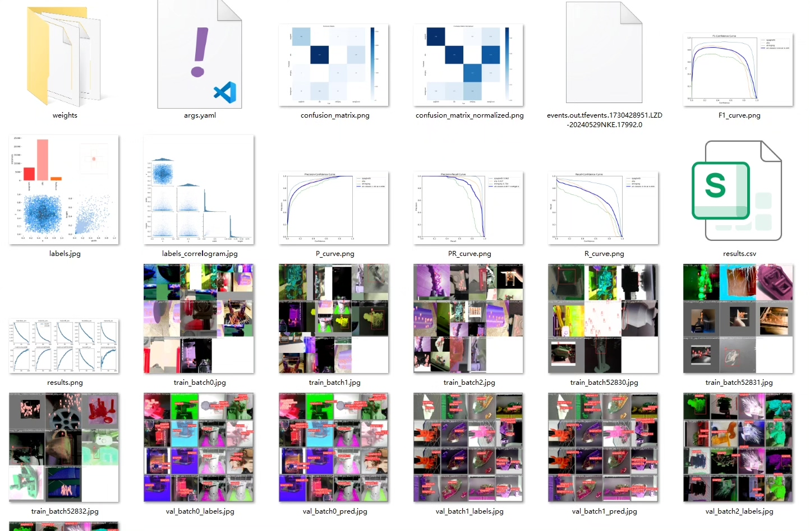
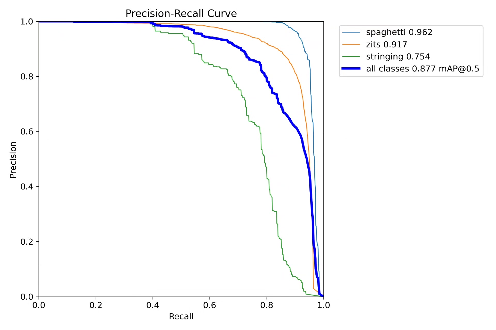
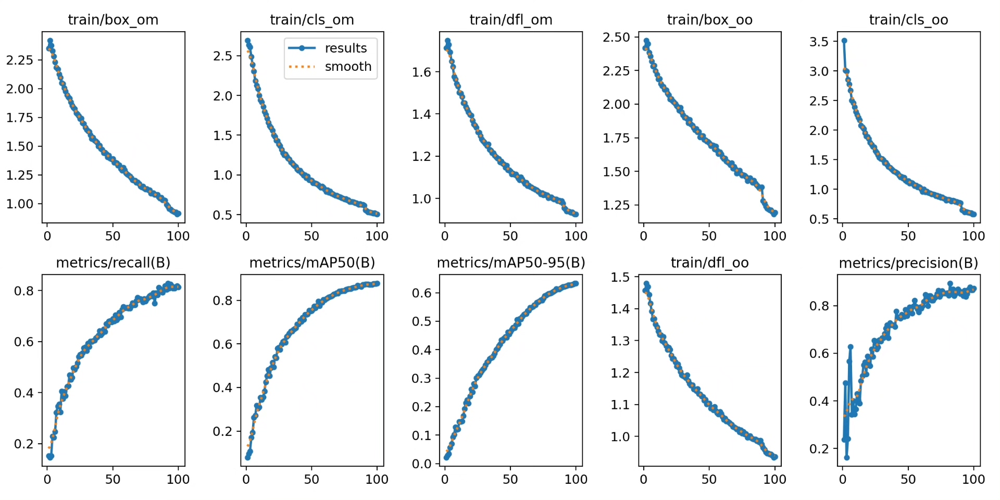
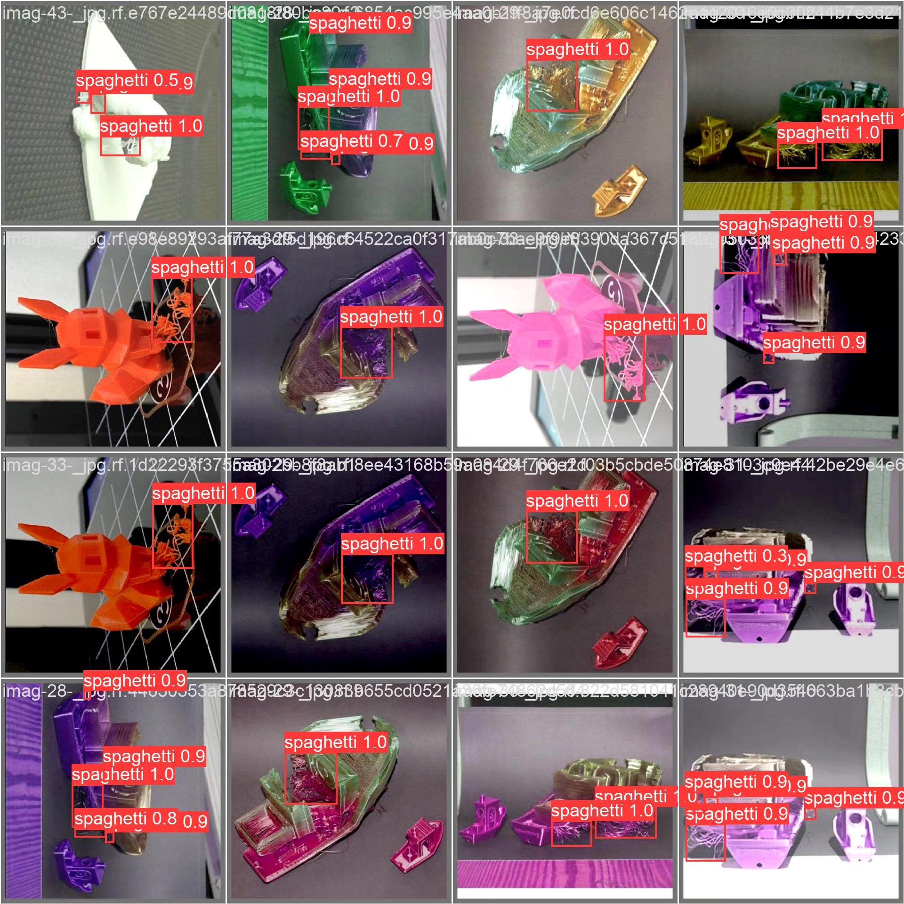
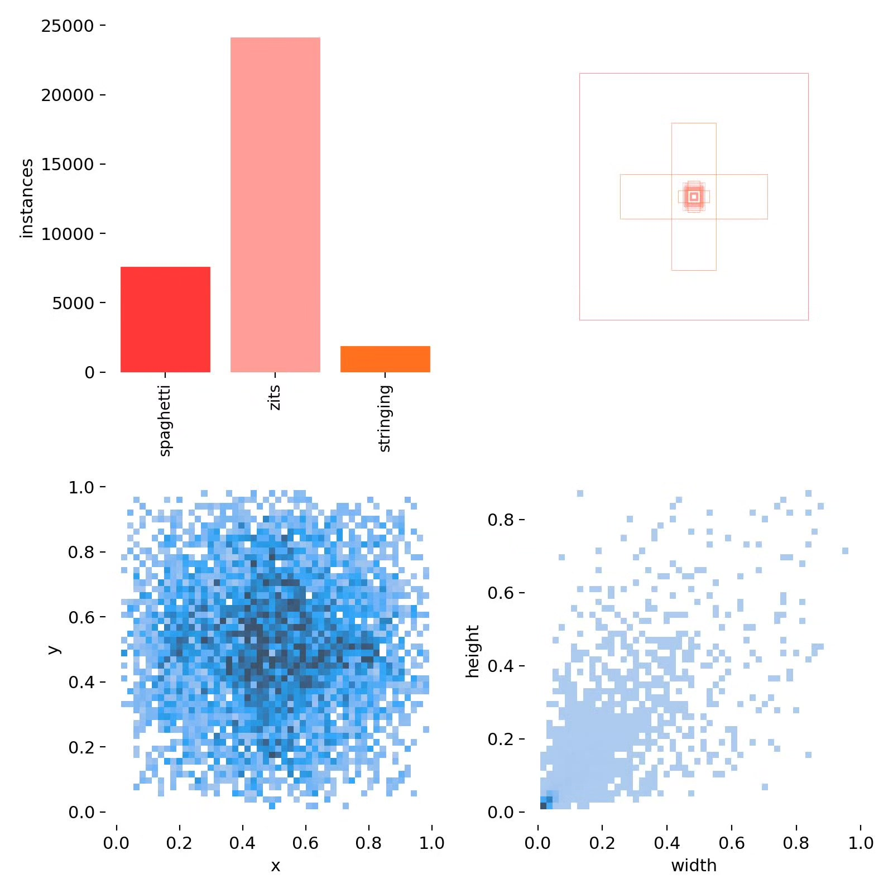
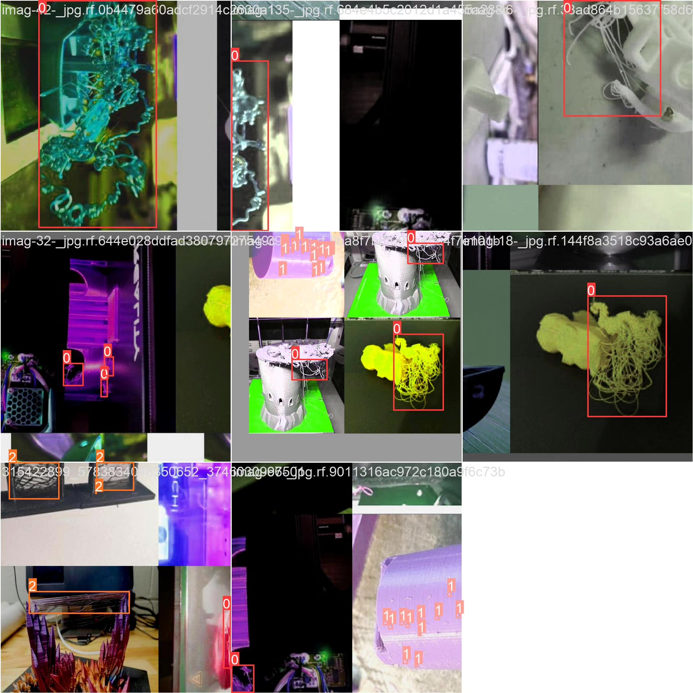

# Based on deep learning YOLOv10 for 3D printing defect detection system (YOLOv

## Body

This project aims to utilize the YOLOv10 object detection algorithm to construct a high-efficiency and accurate 3D printing defect detection system. The system can detect 3D printing defects in real-time from images or videos, and output the detection results. Through training and optimization of the model, the system can accurately identify defects in complex backgrounds, meeting the needs of 3D printing quality monitoring.

The company's products have obtained the official commercial license certification of YOLO.

We provide after-sales service.

After payment, we will provide WeChat ID for any questions.

Environment configuration: We will provide an environment configuration tutorial, and WeChat will provide answers.

Remote installation service: If you need remote configuration, an additional fee of 69 is required, with all fees refunded if the configuration fails (only refund installation fees for older computers).

Retraining dataset: After setting up the environment, you can train on your own computer. If you need us to retrain, just pay 69 plus computing power fees (2.5 yuan/hour).

Full after-sales service

## Images

## Payment

Here is a pay link on Stripe ( https://buy.stripe.com/3cs8yP7sY87d0vu9AB ). Please contact me lonlonago@foxmail.com after funding $89, and I will send you a complete data files , thank you!

